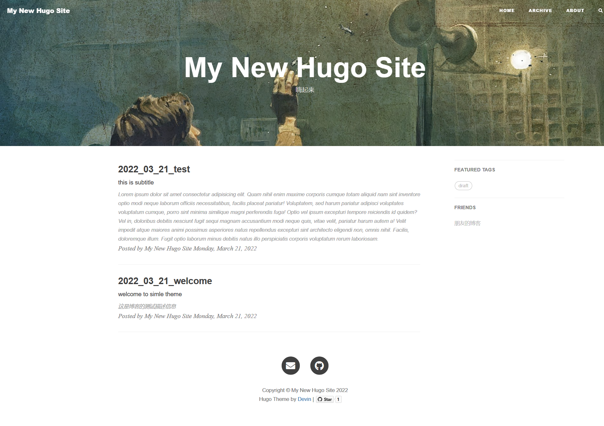
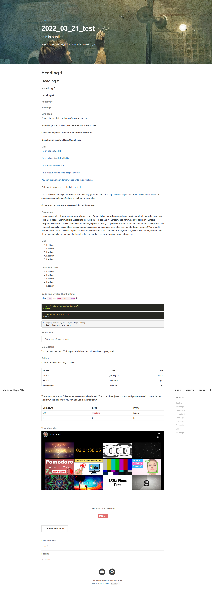
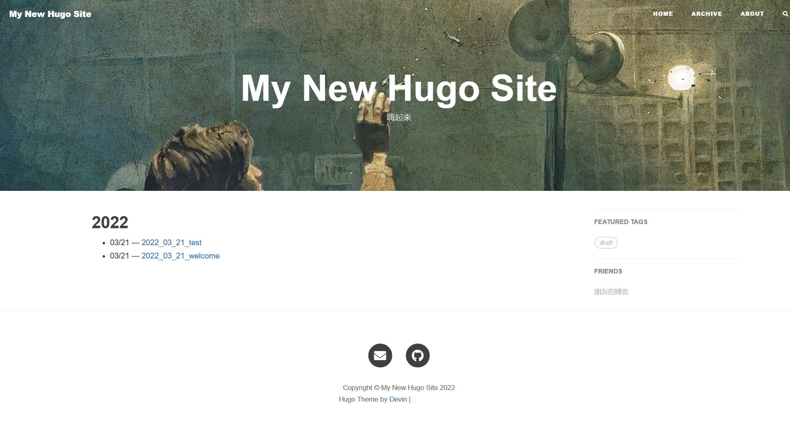
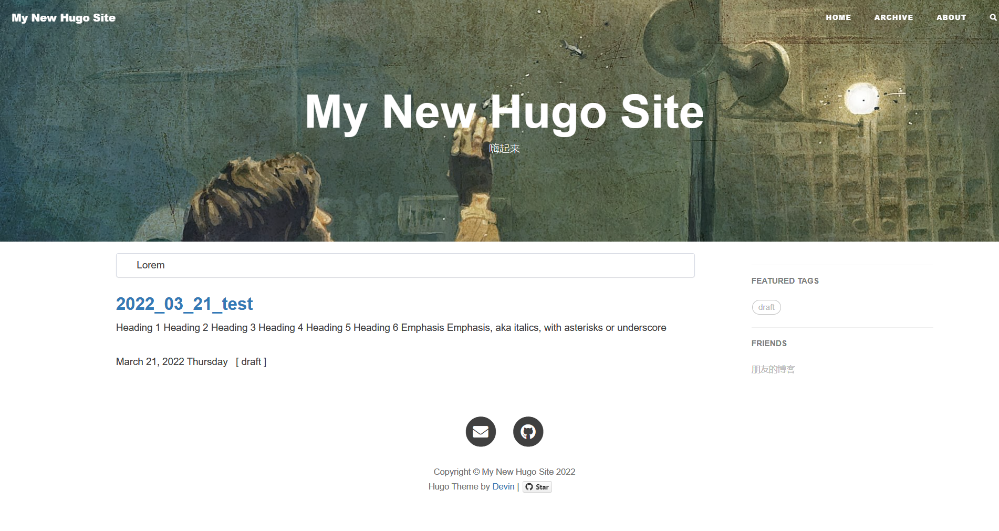
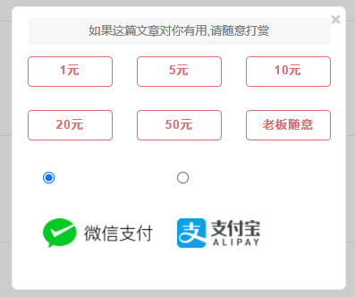
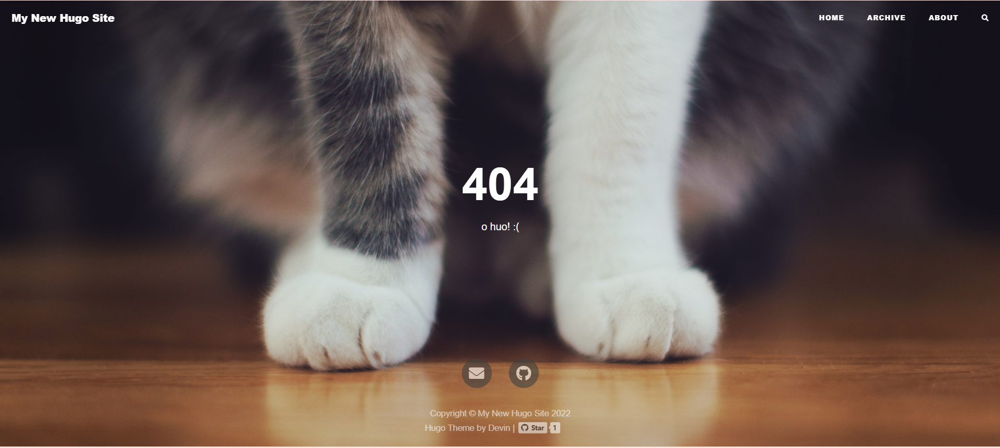

这是本博客的第一篇文章，以后会慢慢更新一些平时我觉的有意思的文章，比如生活，技术，心情等:smile:

下面是本博客大概的面貌。

好！今天结束！

## Screenshots

**Home**


**blog**


**archive**


**search**


**about**


**reward**


**404**



## Quick Start

The simplest way is to start with the example site coming with this theme, then you can play around and add your own stuff.

```shell
$ mkdir hugo_test && cd hugo_test
$ mkdir themes && cd themes
$ git clone https://github.com/StinkyPeach/hugo-simple-theme.git
$ cp -r hugo-simple-theme/exampleSite/** ../
$ cd ..
$ hugo serve -D --port 8000
```

Now enter [`localhost:8000`](http://localhost:8000) in the address bar of your browser.

### Wechat Pay & Alipay Rewards

You can enable Wechat Pay & Alipay to allow readers send you money. So if they like your articles, you may even get rewards from your writing. Now you must be motivated to write more.

If this helps you, if you can  star  this repository, I will be very grateful, thank you!