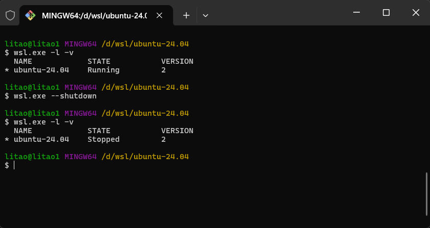
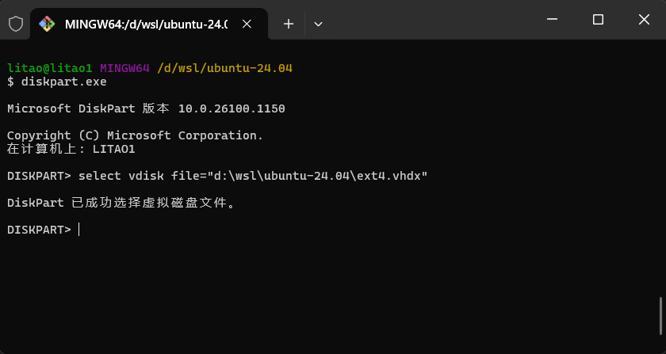
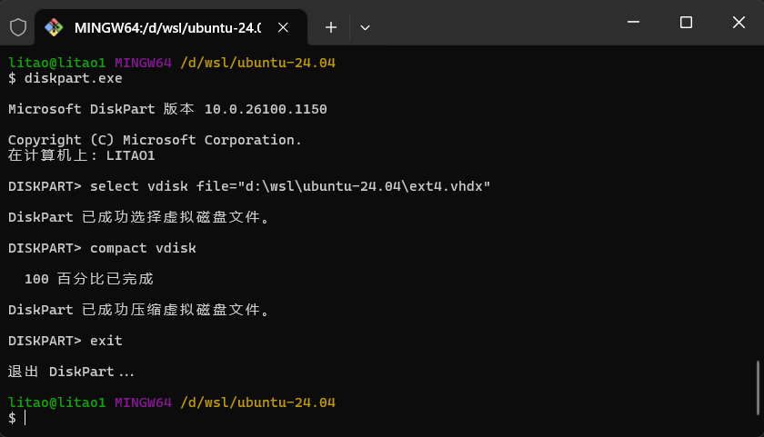
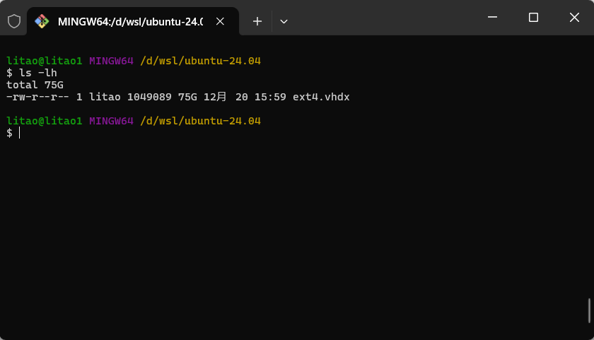

<h1 align="center">
	compact disk for wsl2
</h1>

细心的朋友可能发现了，wsl2在使用过程中，磁盘占用空间会越来越大，但是实际占用空间可能没那么大，如若置之不理，最后会撑爆我们的磁盘🥲🥲🥲。

## 关闭wsl
首先我们通过管理员模式打开命令行窗口,我这里就以`git-bash`来做演示。

```shell
wsl.exe -l -v
wsl.exe --shutdown
wsl.exe -l -v
```


## 原始wsl磁盘空间

进入子系统磁盘所在目录，执行命令。

```shell
ls -lh
```


可以看到现在目前占用磁盘109G。

**注意：压缩前请尽可能的释放wsl2子系统的磁盘空间，比如删除不需要的文件，镜像等**

## 执行压缩
执行diskpart命令进行磁盘压缩。

```shell
diskpart.exe

# 这里使用windows的路径格式,指定wsl的磁盘路径
select vdisk file="d:\wsl\ubuntu-24.04\ext4.vhdx"
```



如图，已经选中磁盘文件，最后只需要压缩即可。

```shell
# 压缩
compact vdisk

# 退出
exit
```



静静等待完成即可。大概几分钟😁😁😁。

## 查看压缩后的磁盘空间

```shell
ls -lh
```



可以看到压缩磁盘后，占用磁盘75G，压缩的磁盘空间大小取决于需要先删除子系统里的不需要的文件。