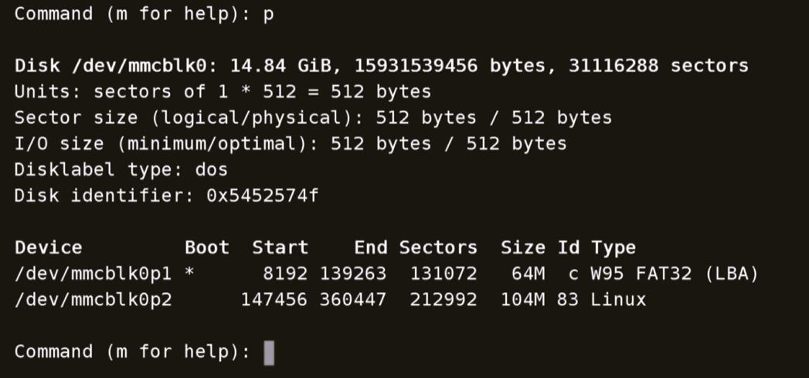
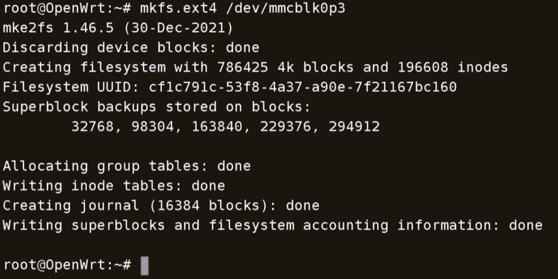
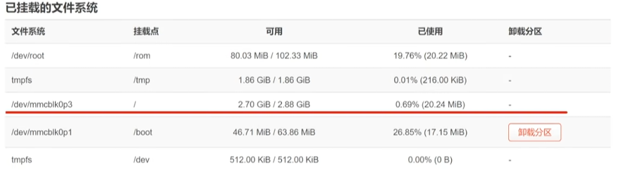
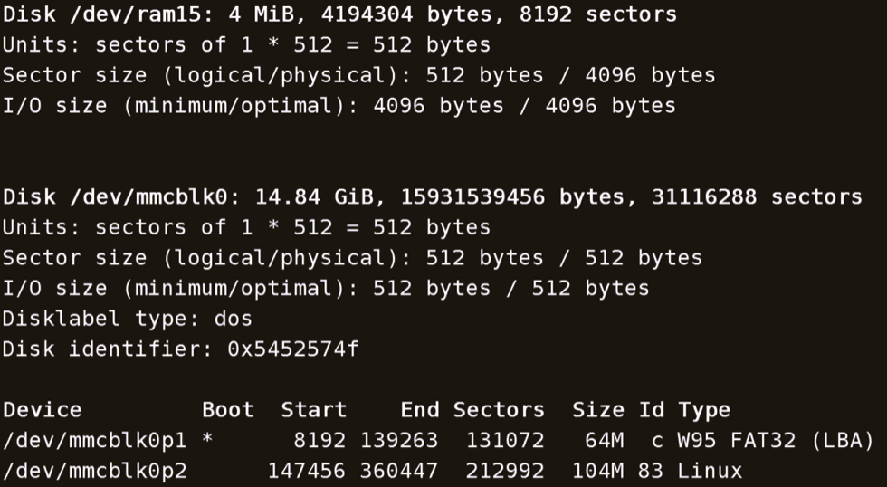
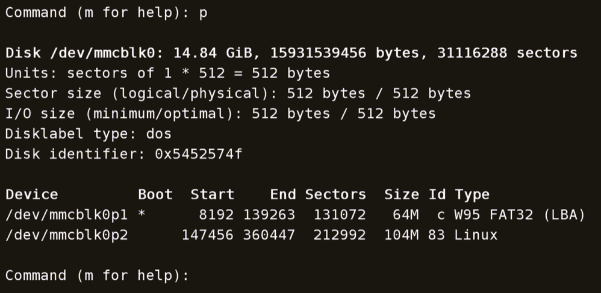
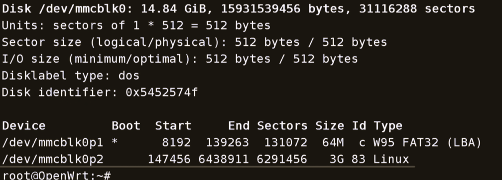
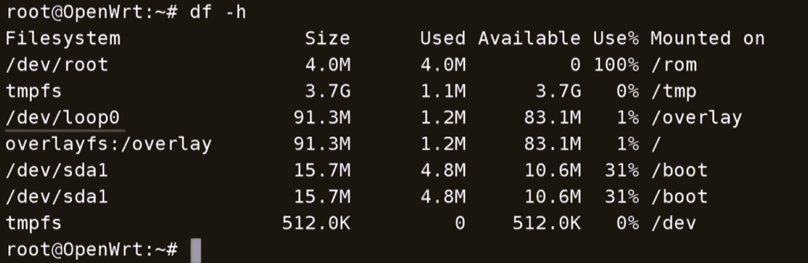
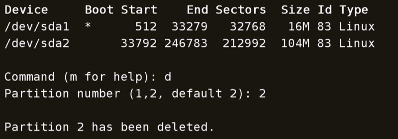
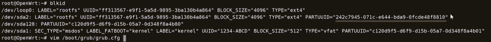
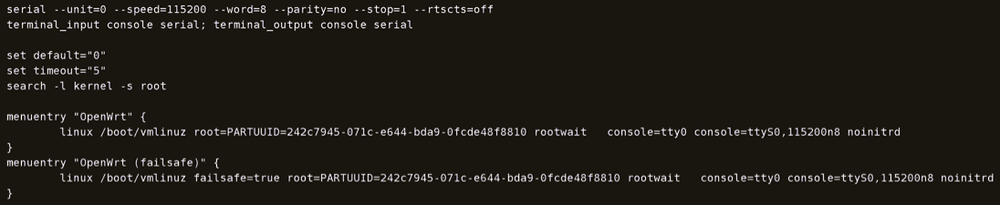

<h1 align="center">	
    expand root partition on OpenWrt
</h1>

由于OpenWrt默认镜像的分区空间一般只有100M左右，无法满足一些日常操作，比如运行容器和一些web服务等。本期我们尝试在成功刷入OpenWrt后，如何对根分区进行扩容。

OpenWrt镜像一般分为2个大类，扩容就是将存储未格式化的部分加入使用。

- EXT4固件
- SQUASHFS固件（可恢复出厂设置，重置固件）


## EXT4 固件扩容

这个固件扩容一般有2种方式。


### 固件扩容方式一

```shell
# 列出磁盘
fdisk -l
# 选择需要操作的磁盘
fdisk /dev/mmcblk0
# 输入p, 查看分区信息
p
# 输入n, 创建新分区, 具体操作可查看下图创建新分区
n
# 分区创建完成后，可查看磁盘分区信息
fdisk -l
# 格式化新分区
mkfs.ext4 /dev/mmcblk0p3
# 网页更改挂载点
# 重启
reboot
```

列出磁盘信息


查看分区信息



创建信息分区（**注意：创建新分区时，first sector值一定要大于原分区的end值，具体值需要通过p命令查看**）


查看创建分区后的信息，可知/dev/mmcblk0p3就是刚刚创建的新分区


格式化新分区



网页更改挂载点

- 选择新创建的分区

- 作为根文件系统使用

- 然后复根目录准备命令到记事本，然后更改/dev/sda1为新创建的分区

- 勾选已启用

- 最后选择保存

- 保存并运用

如图所示


将根目录准备命令修改后全部复制到终端执行，然后重启


重启后分区扩容就完成了



### 固件扩容方式二

```shell
# 列出磁盘
fdisk -l
# 选择需要操作的磁盘
fdisk /dev/mmcblk0
# 输入p, 查看分区信息
p
# 输入d, 删除分区
d
# 输入n, 创建分区
n
# 分区创建完成后，可查看磁盘分区信息
fdisk -l

# 使用新创建的磁盘空间
# 查看循环设备, 如果有输出，就别使用这个输出的设备就行
losetup

# /dev/loop0循环设备路径 /dev/mmcblk0p2 新分区路径
losetup /dev/loop0 /dev/mmcblk0p2 新分区路径

resize2fs -f /dev/loop0
# 如果是x86固件，并且固件带efi字样的需要在设备重启之前更改一下系统引导，具体请看单独的章节"x86固件更改part uuid"
reboot
```

列出磁盘信息



查看分区信息



删除mmcblk0p2分区（**注意：记住这个分区的start值，现在是147456**）


创建新分区（**注意：新分区的first sector的值是上一步记住的start值**）


列出磁盘分区信息



调整应用空间


## SQUASHFS固件扩容

```shell
# 查看磁盘空间信息
df -h
# 查看磁盘信息
fdisk -l
# 操作磁盘
fdisk /dev/sda
# 输入p, 查看分区信息
p
# 输入n, 创建分区
n
# 如果是x86固件，并且固件带efi字样的需要在设备重启之前更改一下系统引导，具体请看单独的章节"x86固件更改part uuid"

# 分区创建完成后，重启
reboot

df -h
# /dev/loop0是df -h显示的循环设备
resize2fs -f /dev/loop0
```

查看磁盘空间信息（**注意循环设备路径，下面需要使用**）



查看分区信息


删除sda2分区（**注意：记住这个分区的start值，现在是33792**）



创建新分区（**注意：新分区的first sector的值是上一步记住的start值**）


分区创建完成后，重启


调整并应用扩容空间


## x86固件更改part uuid

```shell
blkid
# 复制part uuid

# 更改系统引导参数
vim /boot/grub/grub.cfg
```

查看part uuid



更改系统引导，将part uuid更改为复制的新分区的part uuid



更改完成后就可以重启了。